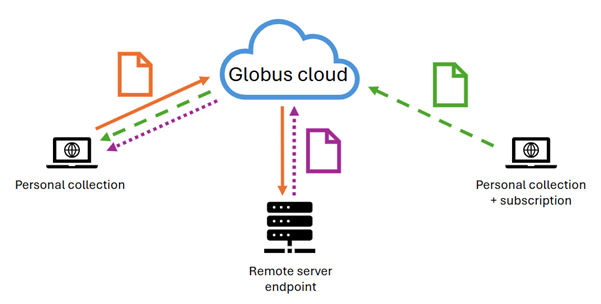
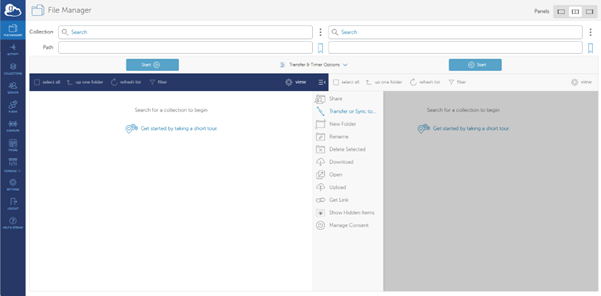
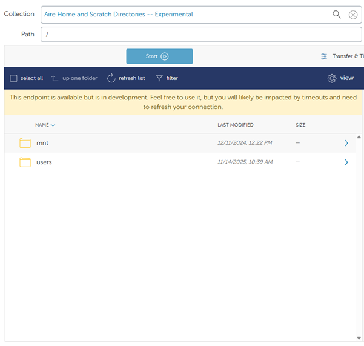
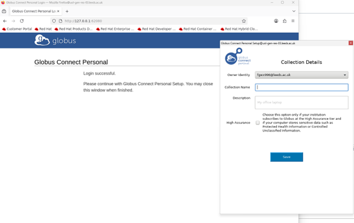
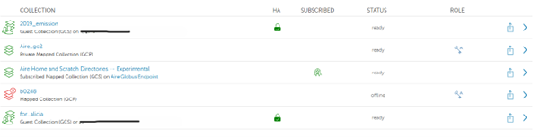
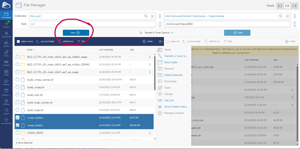

# Guide to using Globus

by Alicia, 04/12/2025
(last updated 04/12/2025)

### What is Globus?

Globus is an online platform for research data management and transfer. You can use Globus to move, share, and access large datasets from different collaborators regardless of institutions or storage systems if they also have Globus.
You may also be able to use Globus to move your own data from different storage systems, but this requires a subscription (and approval from UoL IT).

### What types of Globus are there?

<b>Globus Connect Personal (GCP)</b> - install on your personal computer or in your home directory on a remote machine. You can then set the data directory for transfer (called a collection). 
Globus Connect Personal is useful to set up on foe-linux-cpu, for example, and set the collection as a directory on one of the mounted disks, such as p0106.

<b>Globus Connect Server (GCS)</b> - installed by research IT on an HPC and allows for data transfer of multiple users on the same system without installation of individual Globus Connect Personal accounts. 
On Aire, the Globus Connect Server endpoint is called Aire Globus Endpoint and the named collection is called Aire Home and Scratch Directories--Experimental. You don't have to install anything on Aire to use it, just log in to Globus.org to open the connection.

### How does this work?

You can create a personal collection (GCP collection) on one computer and transfer data from another GCP collection or from a server endpoint collection (GCS collection). 
You cannot share data from a GCP collection to another GCP collection without a paid subscription. 
The best option is to transfer the data from your GCP collection somewhere to Aire using the Aire endpoint, then transfer from Aire to another GCP collection.



### How do I use the Aire Globus Endpoint?

All of Globus, both GCS and GCP collections, are accessible through the online portal. Go to Globus.org and log in using the University of Leeds organization login (continue and allow when prompted). This will take you to the Globus online File Manager.



To access the Aire Home and Scratch Directories -- Experimental GCS collection, type ‘Aire’ into the search bar next to Collection at the top of the screen. 
The Aire Home and Scratch Directories collection should be the top find. You can click on this, and the /mnt and /scratch directories should appear in your File Manager panel. 



**Note**: currently this endpoint is experimental (hence the name) and experiences frequent timeouts. While frustrating, the endpoint does work. Just keep refreshing if necessary. 

To find your data on Aire, type the path to your data in scratch in the Path bar in the File Manager and hit enter.

You can delete, copy, move, and rename any files or directories in your scratch space on Aire. You can also move files from this scratch space to a GCP collection somewhere. To do this, set up Globus Connect Personal on a personal computer or home directory of a remote server (instructions below), then search for that collection in the second Collections search bar.

### How do I set up Globus personal?

Installation of Globus Connect Personal is easy on most remote machines. HOWEVER, foe-linux-cpu is currently not set up correctly to register your GCP collection.

<ol>
  <li>Move to your home directory.</li>

```bash
cd \$HOME
```

  <li>Download Globus Connect Personal and extract the tarball.</li>

```bash
wget <https://downloads.globus.org/globus-connect-personal/linux/stable/globusconnectpersonal-latest.tgz>
```

```bash
tar xvf globusconnectpersonal-latest.tgz
```
  
  <li>The extracted directory will have a version number such as globusconnectpersonal-x.y.z. Move to this directory.</li>

```bash
cd globusconnectpersonal-x.y.z
```

  <li>Set up Globus Connect Personal. You can do this with a pop-up window or entirely through the terminal shell. If you want to use the pop-up window, remove --no-gui from the code below.</li>

```bash
./globusconnectpersonal -setup --no-gui
```

  <li>If you are continuing through the terminal shell, then a URL will appear. Copy this into a browser. You can change the label of the collection if you want. Hit Allow. If you are not using the terminal shell, a browser window will pop up. Follow the instructions and skip Step 6 below.</li>



  <li>Copy the provided Authorization Code, then paste into your terminal window where it says 'Enter the auth code:'</li>
  <li>When prompted, enter the name you want to call this personal endpoint. It should be descriptive to the collection, so you don't confuse different collections on different computers.</li>
  <li>Globus will set things up. Once finished with the registration and set-up, you'll get a 'Success' message in terminal, and you should be able to find the collection in your File Manager on Globus.org.</li>
  <li>If the registration and set-up take too long (over a minute to load), then there are likely firewall or system issues blocking the registration. This is the current situation on foe-linux-cpu. For UoL computers, log an IT ticket with the problem.</li>
  <li>Once Globus Connect Personal is installed and registered, you can set the path to the directory you want to use as the collection endpoint. Open the .globusonline/lta/config-paths file or create a new file if it does not exist yet.</li>

```bash
vi .globusonline/lta/config-paths
```

  <li>If the file already exists, it will have ~/,0,1 as the top line. This information lists the sharing (0 - no sharing) and read/write (1 - yes read and write) access of files in the home directory (~/). Modify the file so the top line includes the path to the directory you want to use as a collection endpoint. For example, if you want this to be in your directory on p0106, add the following as the first line of the file.</li>

```bash
/uolstore/RIT/RITCore/Env/p0106/Users/yourusername/,0,1
```

Because this is a Globus Connect Personal account without a paid subscription, you can't share out of this directory (first digit must be 0) unless you are connecting to another paid subscription personal collection or to a Globus Connect Server account such as on Aire.

  <li>Save the changes to the config-paths file. You are now ready to use this collection.</li>

</ol>

### How do I use Globus Connect Personal to move data?

Once you've installed Globus Connect Personal on your personal computer or a remote server somewhere, you can find the collection on Globus.org.

<ol>

  <li>Go to Globus.org and log in through the University of Leeds account.</li>
  <li>On the left-hand menu, find Collections. Click this button.</li>
  <li>The Collections page will show a list of all collections you have access to. If you have not yet created a personal collection or accessed the Aire Home and Scratch Directories -Experimental collection, nothing will appear here. 
    Go back and create a GCP collection on the server/computer of your choice. Find the Aire Home Scratch Directories -- Experimental collection.</li>
  <li>Some collections will appear green and have STATUS = ready. Others will be red and have STATUS = offline. To change the status of a personal collection from offline to ready, log in to the computer with the registered personal collection.</li>



  <li>Move to the globusconnectpersonal-x.y.z directory.</li>
  
```bash
cd globusconnectpersonal-x.y.z
```

  <li>Start the personal collection session.</li>

```bash
./globusconnectpersonal -start &
```

The & keeps the session running in the background.

  <li>Return to the Globus.org File Manager. On the File Manager screen, in the collection window, search for the personal collection you just activated. It might take a few moments for Globus.org to register that the collection is active and ready.</li>
  <li>Once the collection is loaded in File Manager, you can move, delete, and rename existing files. You can also create a new directory.</li>
  <li>To share or transfer data, find another collection in the second Collection search bar on the File Manager page. 
    This collection must either be a subscribed GCP or a GCS collection. To test the tranfer process, you can use Aire Home and Scratch Directories - Experimental.</li>
  <li>Select the file(s) you want to transfer from one collection. Click the Start button on the side with the files you selected for transfer.</li>



  <li>Once the transfer has started, a window will appear in the top right of the screen letting you know the transfer has successfully started. If something goes wrong, another window will pop up to alert you. 
    You can also check the status of a transfer by clicking on Activity on the left-hand menu. 
    The Aire Home and Scratch Directories - Experimental collection experiences frequent timeouts but will restart the transfer automatically unless you terminate the process.</li>
  <li>A green check will appear next to completed transfers, and you will get an email alert. You can then refresh list on the File Manager page for the collection you moved the data to, to see the successful transfer.</li>
  <li>Once you have completed all the transfers, you can logout of Globus.org and shut down the GCP collection by typing in the command line.</li>

```bash
./globusconnectpersonal -stop
```
