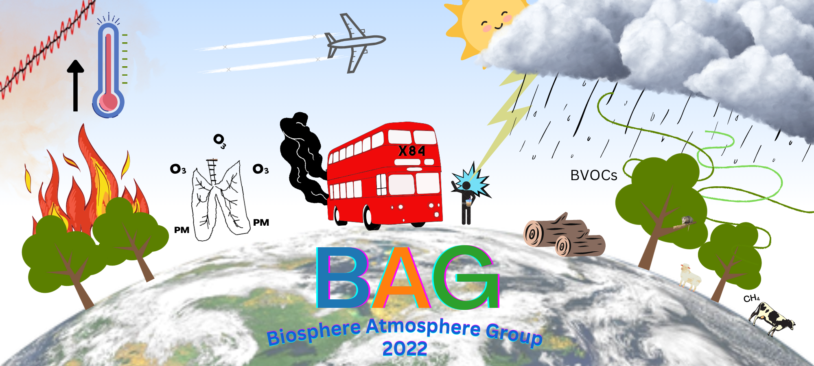

# Welcome to the BAG Wiki!

This is a wiki for Leeds Biosphere and Atmosphere Group (BAG) to share computing and technical guides and tips

## Contributing
If you'd like to contribute, thank you! There are a couple of ways to contribute:

1. Write a guide
2. Suggest a guide or tip

If you'd like a guide to be made, add your (new) suggestion to the BAG wiki to do document on Teams. If you can help write a guide, there a few ways to do this:

- Without using GitHub (easy and simple):
    - Write your notes in a word doc and send to admin (easiest)
    - Write your guide in .md (Markdown) and send to admin (easy). You can use an online markdown editor, VSCode or even good old Notepad to write your .md file!
- Using GitHub
    - Have your account invited to this Organisation
    - To add files to the website, go to the docs folder and create or upload a file
    - Commit this change using the button, writing a short description of your change
    - Link your file on the website, by editing 'mkdocs.yml' and listing your file information in the how to guides section

Notes on submissions:

- Title your guide or tip
- Add your name and date of article in format: Author: name name, mon year (last updated: mon year)
- Add headings where appropriate to subdivde the guide
- Add media as much as possible, visual guides are often more compelling than lists! 
 
