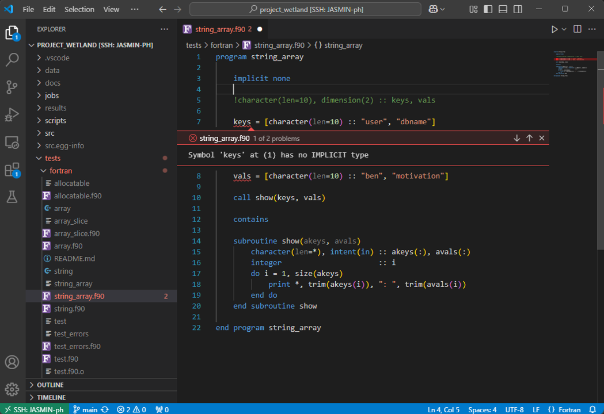

# Dragging Fortran kicking and screaming into the 21st Century

Author: Ben Bradley, Feb 2026 (last updated: Feb 2026)


## What is Fortran?

Fotran is one of the first programming languages, wiht the first versions dating back to the 50's. It is a compiled language, which means code is compiled to faster machine code before it can be run (unlike Python which is compiled just-in-time). It has been used extensively in scientific modelling for many decades, and will likely continue to be used for some time still.


## Why use fortran?

- **Speed**:        Fortran is much faster than Python and other high-level languages
- **Legacy**:       many established scientific models use Fortran, making it essential for adding to or modifying the existing codebase
- **Self-hatred**:  you're some sort of masochist who enjoys declaring the types of all variables


## How to minimise the pain

If you find yourself in the unenviable situation of needing to code in fortran, do not dispair! You don't have to code in the terminal like some sort of caveman! VS Code has an extension called _Modern Fortran_ to solve all of your problems. This can provide wonderful features such as:

- Syntax highlighting
- Linting (_before_ compiling!)
- Rulers
- Variable auto-completion
- In-line AI code suggestions
- Easy and intuitive committing of code to GitHub
- All the other [lovely features included within VS Code](https://leeds-bag.github.io/bag_wiki/VSCode_guide/).



## Setting Up

I assume here that the reader is already familiar with VS Code and Python Environments (e.g. Miniforge). If you're not, consult BAG's [Guide to VS Code](https://leeds-bag.github.io/bag_wiki/VSCode_guide/) and [Guide to using Mamba via Miniforge](https://leeds-bag.github.io/bag_wiki/conda_setup/)

### 1) Starting
Open VS Code, ssh into the machine you wish to code on, and open the folder of your project. Install the Modern Fortran extension from the extensions tab.

### 2) Create a Fortran environment

Activate conda if you haven't already:
```bash
conda activate
```

Create a new environment:
```bash
mamba create -n fortran
```

Activate your new environment:
```bash
conda activate fortran
```

Install the fortls and gfortran packages:
```bash
mamba install fortls gfortran
```

### 3) Tell VS Code where the packages are
Open the settings.json file by hitting `Ctrl`+`Shift`+`P` and typing json into the search bar that opens up. Click on "Preferences: Open Remote Settings (JSON) (SSH: [machine])" if you're connected to a remote machine.
Add the following to the file (which is likely empty):
```json
{
    "fortran.fortls.path": "[mypath]/miniforge3/envs/fortran/bin/fortls",
    "fortran.linter.compiler": "gfortran",
    "fortran.linter.compilerPath": "[mypath]/miniforge3/envs/fortran/bin/gfortran",
    "fortran.formatting.formatter": "fprettify",
    "fortran.linter.includePaths": "[mypath]/miniforge3/envs/fortran/include",
}
```
Replace mypath with the path to your Miniforge directory.

### 4) Add a ruler
Old versions of Fortran have a strict character limit for lines of code, and can fail to compile code after this limit. To avoid these errors and to help keep code to best practices, I like to add a ruler to the screen at the character limit.

```json
{
    "editor.overtypeCursorStyle": "line",
    "terminal.integrated.defaultProfile.windows": "Git Bash",
    "[FortranFreeForm]": {
        "editor.rulers": [132]
    },
    "workbench.colorCustomizations": {
        "editorRuler.foreground": "#458cff"
    },
}
```


## Further reading

Modern Fortran is an excellent VS Code extension, more details of the features it offers can be found
[here](https://marketplace.visualstudio.com/items?itemName=fortran-lang.linter-gfortran).

This guide draws from a series of excellent YouTube videos by Lukas Lamm.
If you want to dive deeper into the points discussed here or learn more about compiling and running fortran within VS Code,
I recommend checking out his videos [here](https://www.youtube.com/playlist?list=PLcRWSCuguB4RajDON1480xRa5EQ4w2_F0).