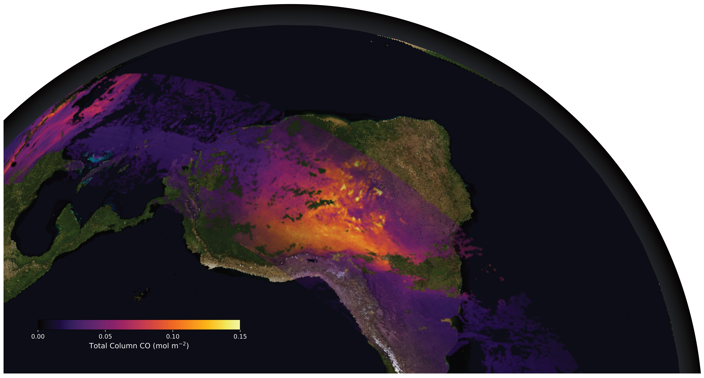
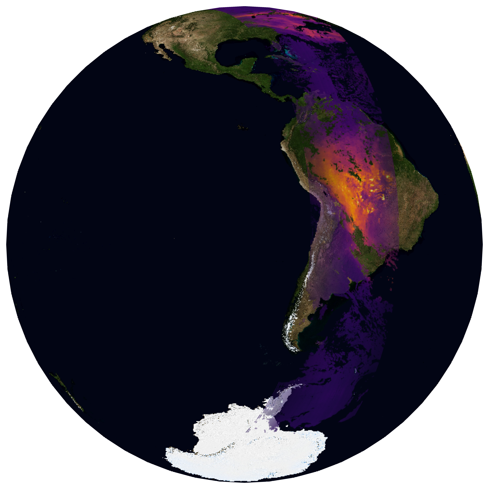
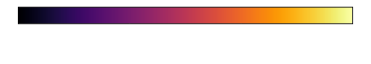

# Plotting poster-quality maps in Python

Author: Ben Bradley, June 2026

I wanted to create a nice image of satellite data overlayed on planet Earth, like a documentary-style plot. With a little help from AI I wrote some code to do this, which I then modified using Affinity graphic design software to create a final image to add to my poster. Here's the code so you can do this too!

## Final result




## Downloading background

NASA provide publicly-available high-res images of the Earth, which you can download and add to the background of your plots! You can select different resolutions too.

Download them here: https://science.nasa.gov/earth/earth-observatory/blue-marble-next-generation/base-map/


## Code for figure

```python
import matplotlib.pyplot as plt
import xarray as xr
import cartopy.crs as ccrs
import matplotlib.image as mpimg
from datetime import date as Date

from src.TROPOMI import load_TROPOMI

from PIL import Image
Image.MAX_IMAGE_PIXELS = 300_000_000  # above your image size

# I have a custom function for loading the xarray data
ds = load_TROPOMI(Date(2020, 9, 16), orbit=10, type="product")

# extract the relevant variables
data = ds.carbonmonoxide_total_column_corrected.values
lats = ds["latitude"]
lons = ds["longitude"]

root_dir = ""
texture_file = f"{root_dir}/bluemarble_Aug_highres.jpg" # High-res Earth image (Blue Marble)
output_file = f"{root_dir}/TROPOMI_CO_20200916_bluemarble_highres.png"

# Center over South America
central_lon = -90
central_lat = -30


# =========================
# CREATE FIGURE
# =========================
proj = ccrs.Orthographic(central_longitude=central_lon,
                         central_latitude=central_lat)
fig = plt.figure(figsize=(10, 10), dpi=1000)#, facecolor='black')
ax = plt.axes(projection=proj)
ax.set_global()
ax.set_axis_off()
ax.set_facecolor('black')

# =========================
# ADD EARTH TEXTURE
# =========================
img = mpimg.imread(texture_file)
ax.imshow(img,
          transform=ccrs.PlateCarree(),
          extent=[-180, 180, -90, 90],
          zorder=0)

# =========================
# PLOT DATA
# =========================
plot = plt.scatter(lons, lats, c=data,
                   cmap='inferno',
                   vmin=0, vmax=0.15,
                   s=0.005,
                   transform=ccrs.PlateCarree(),
                   zorder=1, alpha=0.5)

# =========================
# CUSTOM COLORBAR (add if you want)
# =========================
# cbar = plt.colorbar(plot,
#                     orientation='horizontal',
#                     pad=0.05,
#                     fraction=0.04)

# cbar.set_label("Total Column CO [mol m$^{-2}$]", color='white')
# cbar.ax.xaxis.set_tick_params(color='white')
# plt.setp(cbar.ax.get_xticklabels(), color='white')

# =========================
# EXPORT HIGH-RES IMAGE
# =========================
plt.savefig(output_file,
            dpi=1000,
            bbox_inches='tight',
            transparent=True)
plt.close()
print(f"Saved: {output_file}")
```




## Code for colourbar

```python
import matplotlib.pyplot as plt
import matplotlib as mpl

# =========================
# SETTINGS
# =========================
vmin = 0.0
vmax = 0.15
cmap = "inferno"   # match your main plot
output_svg = "bluemarble_colorbar.svg"

# =========================
# CREATE FIGURE
# =========================
fig, ax = plt.subplots(figsize=(6, 1))  # long horizontal bar
fig.patch.set_alpha(0)  # transparent background
ax.set_visible(False)

# =========================
# CREATE COLORBAR
# =========================
norm = mpl.colors.Normalize(vmin=vmin, vmax=vmax)
sm = mpl.cm.ScalarMappable(norm=norm, cmap=cmap)
sm.set_array([])
cbar = plt.colorbar(sm,
                    ax=ax,
                    orientation='horizontal',
                    fraction=0.8,
                    pad=0.2)

# =========================
# STYLE FOR POSTER
# =========================
cbar.set_label("Total Column CO (mol m$^{-2}$)", fontsize=12, color='white')
cbar.ax.tick_params(labelsize=10, color="white")
plt.setp(cbar.ax.get_xticklabels(), color='white')

# Optional: custom ticks
ticks = [0.0, 0.05, 0.10, 0.15]
cbar.set_ticks(ticks)

# =========================
# SAVE AS VECTOR
# =========================
plt.savefig(output_svg, bbox_inches='tight', transparent=True)
plt.close()
print(f"Saved: {output_svg}.")
```



## Combining in Affinity

I rotated the image, cropped it and added an atmopsheric glow using Affinity, a free graphic design software. You could probably do something similar in Powerpoint if you prefer or feel free to ask me about this. (Panorama/YES runs training on poster design using Affinity annually).