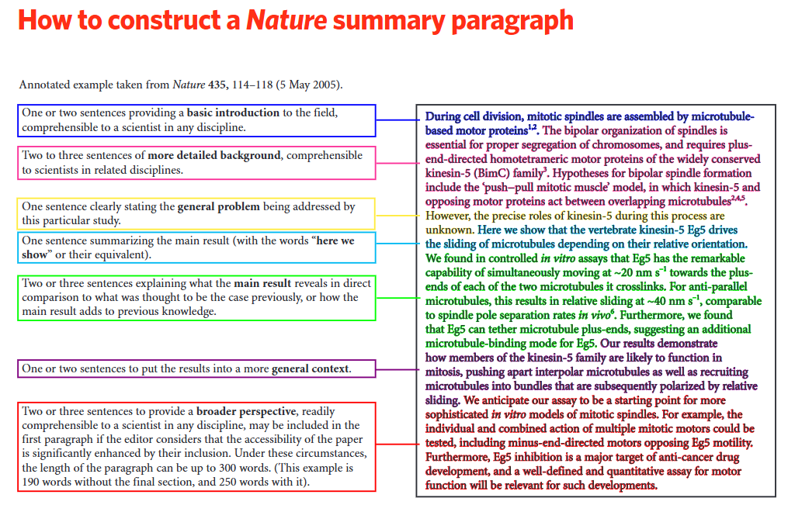

# Writing a Scientific Paper

Author: Dominick Spracklen, Dec 2025 (last updated: Dec 2025)

**Acknowledgements:** Everyone in BAG, Daniel Jacob (Harvard University)

## What and Why
- Scientific papers are the way we share our science with the world.
- A good scientific paper is:
  - Original
  - Interesting
  - Useful
  - Clear, replicable, and readable
- Your scientific papers are a way you get recognised for new ideas and build your profile as a researcher.

## How to Start
- Often the hardest bit.
- Start with an outline. Even writing a title, authors/institutions, and section headers can help overcome the blank page syndrome.
- Once you have an outline, start filling in sections you feel most confident with.
- Figures can help you structure results and decide narrative.
- Start writing early, don’t leave it to the end.
- Learn how and when you best write. Morning/evening? In short sessions or full days? With coffee/wine? Fight procrastination.

## Where to Publish
- Early on, decide if writing a short (letters style) paper or a full-length paper.
- Look at the papers you are citing—where are they published? This can help decide where might be suitable. Often there are a few journals where we submit regularly (e.g., ACP, ERL, Ecological Solutions & Applications).
- Nice to support scientific society journals (e.g., EGU, AGU, BES) who redirect some profits into science and education. Beware some predatory journals where standards are lower.
- Nature, Science, PNAS style journals for the big ideas. Rejection is normal and expected. Be ready to reformat and resubmit.

## Narrative
- Having a clear narrative is important. A figure “storyboard” can help.
- Try and work the narrative out early (it can and will change as you write).
- If something doesn’t help strengthen and clarify your narrative—why is it there? Is it needed?
- Make sure the narrative runs through the paper from Abstract, Introduction, Results, Figures, Discussion to Conclusion.

## How to Make Your Paper Useful
- Think about how people read your paper—most won’t read from start to finish. Make sure each reader can get the information they want:
  - **The passing reader** (reads title and possibly abstract): Clear title and abstract with key results
  - **The more interested reader** (reads title, abstract, figures, conclusions): Clear, self-contained figures that tell key messages
  - **The dedicated reader** (reads paper from start to finish): Sufficient detail and clarity, particularly around Methods.
- Think about what information your readers (other scientists, policy makers, stakeholders etc) might want from your paper. Make sure you provide these key numbers and results clearly & easy to find.
- Think about key results. Repeat in Abstract, Results, Figures, Conclusions so all readers get the key messages. Repetition is good!

## Paper Structure
- Depends on journal
- Most will ask for Abstract, Introduction, Methods, Results, Discussion, Conclusions.
- Often relatively easy to adjust between different journal styles.
- Sometimes works to combine Results and Discussion. When separate, Results present findings without interpretation, Discussion interprets results in context of wider literature.

### Abstract
- Very important to get right—many readers will just read this
- One idea/result per sentence.
- Make sure it has the key messages/results.
- Nature summary guidelines are useful (see below):
  - Basic introduction (a few sentences), problem addressed (1 sentence), what you did (1 sentence), Main results (a few sentences), broader context (a few sentences)
    

### Introduction
- Short and focused is best for most papers
- Focus on key information reader needs to understand your paper.
- You need to have a good knowledge of the literature. Use search engines and citation spider web. Go back to the literature throughout writing your paper. Nothing annoys a reader (or reviewer) more than omitting key (their!) papers.
- Good referencing also helps your paper be found by others. Cite yourself as appropriate
- Sometimes good to end introduction with a clear paragraph saying how your paper builds on the literature.

### Methods
- Often an easy section to start writing, but a hard section to get right.
- Needs to be clear and concise but enough detail to make your work repeatable.
- Think about the key papers your work builds on. Did they provide sufficient information for your work? Think about the frustrating information they missed. Make sure you include.

### Results and Discussion
- Needs to be logical. Think about your narrative.
- Take the reader through the results in a logical and linear way. One idea/theme per paragraph. Keep paragraphs relatively short (5–10 sentences maybe). If you start to introduce a new theme, time for a new paragraph.
- Keep text as concise. You don’t need to describe everything in a figure or table. Your job is to highlight the important results.
- Often easiest to structure around your figures.
- Important to compare to previous work. Puts your results in context.

### Limitations
- Don’t get obsessed with limitations!
- Turn perceived weaknesses/limitations into strengths. Identify and adapt and update methods to address (e.g., to account for uncertainty in dataset X, we tested an alternative dataset and found similar results).

### Figures and Tables
- The figures tell your story and should be aligned with your overall narrative.
- Make sure the figures tell the key results. Cross check the Abstract, Figures, Results and Conclusion. Are there key results that aren’t visualised in a Figure?
- Figures need to be clear and visually attractive. Would you use the figure in a presentation? If not, try to improve.
- Make figures and tables useful—can readers get key results/numbers from tables and figures?
- Figure and caption should be “self contained”. Many readers will skip through the figures, they should be able to understand what you have done and the key results without having to read all the text. Better to have these details in figure caption rather than in text.
- Axis titles, legends, units need to be clear and in suitable font size. Think about how your figure is likely to appear in your paper. Avoid long and confusing experiment names (e.g., CMIP7_clm_tas_8, rename as something sensible)

### Conclusions
- Key take home messages (like Abstract) but less limited by word count.
- Structure logically to take reader through the key messages. Often good to start with one concise paragraph to describe what you did and why. Then a paragraph for each key message in your paper.
- Remember many readers will skip straight to Conclusions—so make sure this is understandable to readers that haven’t read the whole paper

### Co-authors, Acknowledgements, Funding
- Anyone who has done work for the paper or contributed important ideas should be a co-author. Anyone who has developed a new capability (e.g., new model) that underpins your work should be offered co-authorship. Acknowledgements can be for people who have helped in small ways that don’t warrant co-authorship.
- Many journals now ask you to describe how different co-authors have contributed. This can help with deciding the co-author list.
- First author is you! Senior author (i.e., PI or supervisor) often last or second. Other than this the order has little meaning. Can just be ordered alphabetical.
- Funding—the PI/supervisor will know what funding needs to be acknowledged.

## Final Checks
- Make sure you use terms, units, acronyms, terminology consistently.
- Make sure Results reported consistently (i.e., same number in Abstract, Results and Conclusions)
- Keep sentences short. Active present form often best.

## Review Process
- Once you submit your paper, a journal editor will decide whether to pick up your paper for review. Some journals are more selective than others at this stage.
- The Editor then sends your paper to be reviewed by 2 or more independent reviewers (some journals allow you to recommend potential reviewers).
- Reviewers provide comments and advise the journal editor, who makes the final decision.
- Often you will be invited to resubmit, after responding to reviewer comments and revising your paper

## Responding to Review
- Try (!) to be respectful of the reviewer who has given their time to review your work.
- Hard to take criticism of your work. Take time to reflect on comments and to see it from their perspective.
- Normally you resubmit a “Response to Review” and a Revised Manuscript.
- Response to Review goes through each reviewer comment in turn. Keep the response short, pleasant and positive. Don’t get dragged into long arguments.
- Try to respond to each comment by making a change to your paper to address the concern (e.g., add text, add a sensitivity experiment, test a different approach etc).
- Flag up key edits in the Revised Manuscript (track changes or mark up additions manually).

## Publication is the First Step
- You need to advertise your work. Make your paper work for you. (Could be another whole session on this.)
- Press release if appropriate. Need to talk to the press office early (this can take weeks to organise).
- Or reach out to specific media contacts (look at who covered similar or related work in the past). Sometimes better than a blanket press release. Cultivate good relationships with key media contacts; as they get to know you they may reach out to you for news.
- Blog on Uni website (Leaf, BAG etc).
- Presentations at conferences and project meetings. Contact colleagues and give “invited” talks.
- Social media.
